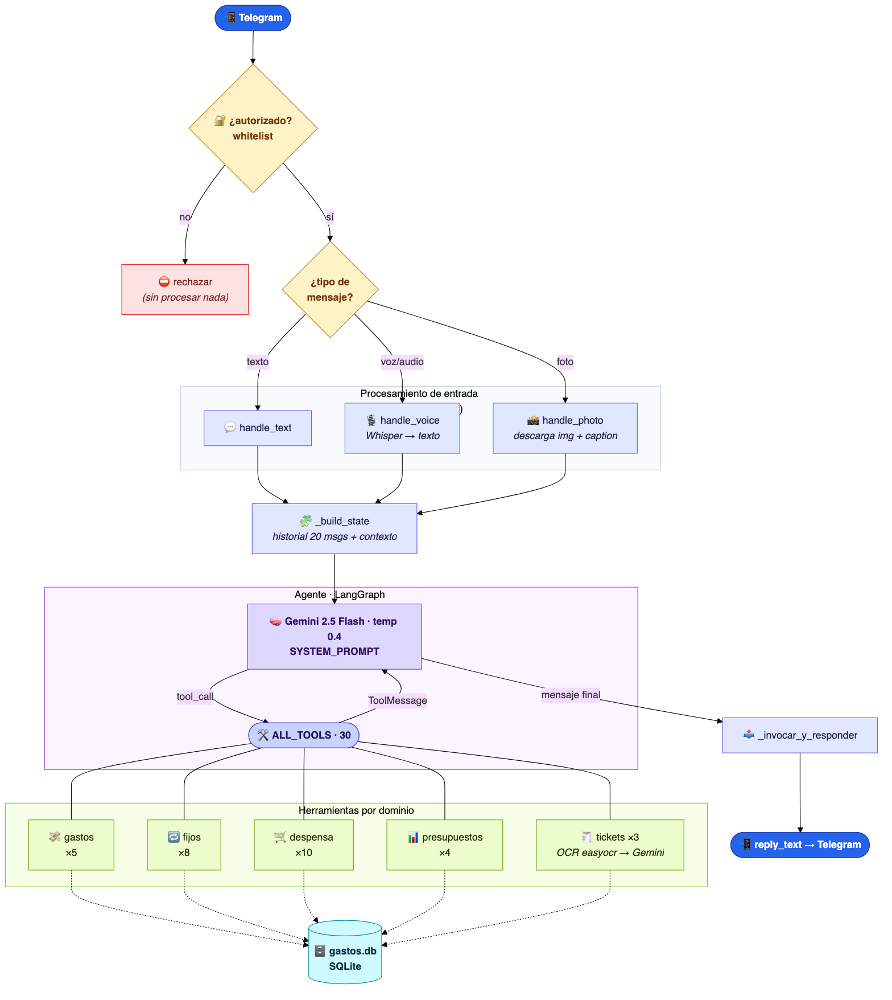
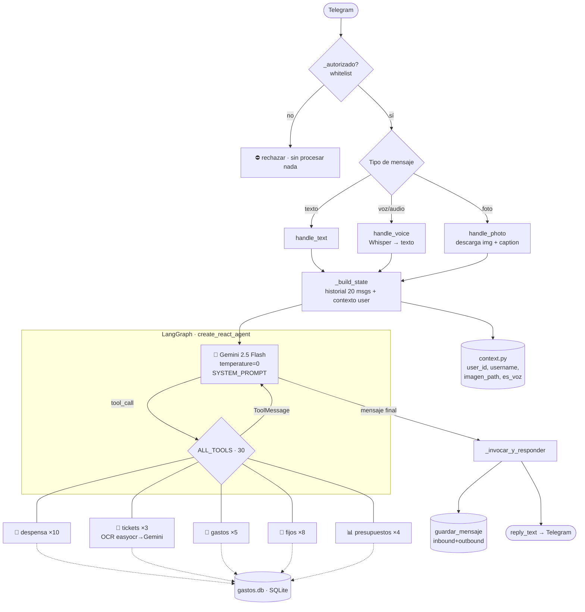

# Arquitectura de Kontos

Bot de Telegram para finanzas y despensa, sobre un agente **ReAct** de LangGraph
(`create_react_agent`) con Gemini 2.5 Flash y 30 herramientas en 5 dominios.



> El PNG se regenera con `mmdc` a partir del diagrama Mermaid de abajo.
> El grafo interno crudo de LangGraph (start → agent ⇄ tools → end) está en `grafo_langgraph.png`.

## Grafo de conversación

> El filtro de whitelist (`_autorizado`) corre **antes** de cualquier procesamiento:
> si el usuario no está autorizado se rechaza sin descargar la foto, transcribir audio ni llamar a Gemini.



## Camino de un ticket (OCR)

```
foto → handle_photo → caption "procesar ticket" → agente decide → procesar_ticket()
  → _ocr_imagen (easyocr es+en)  ──► texto OCR
  → Gemini: "extrae productos como JSON"  ──► parse_json_from_text()
  → si data=None → "❌ No pude interpretar"   (fallo silencioso)
  → si OK → INSERT tickets_ocr + compras_despensa → "🧾 Ticket registrado"
```

## Herramientas por dominio (`tools/ALL_TOOLS`)

| Dominio | Módulo | Herramientas |
|---|---|---|
| 💸 Gastos | `tools/gastos.py` | registrar, listar, editar, eliminar, consultar_total |
| 🔁 Fijos | `tools/fijos.py` | gastos fijos (CRUD) + ingresos fijos (CRUD) |
| 🛒 Despensa | `tools/despensa.py` | productos (CRUD), compras (CRUD), lista, predicción |
| 📊 Presupuestos | `tools/presupuestos.py` | crear, ver, editar, eliminar |
| 🧾 Tickets | `tools/tickets.py` | procesar (OCR), listar, eliminar |

## Despliegue

- Host: `archlinux` (Tailscale `100.72.31.71`), `~/kontos`.
- Servicio: **systemd** `kontos.service` (no Docker), venv en `~/kontos/venv`.
- Datos: `gastos.db` (SQLite local).
